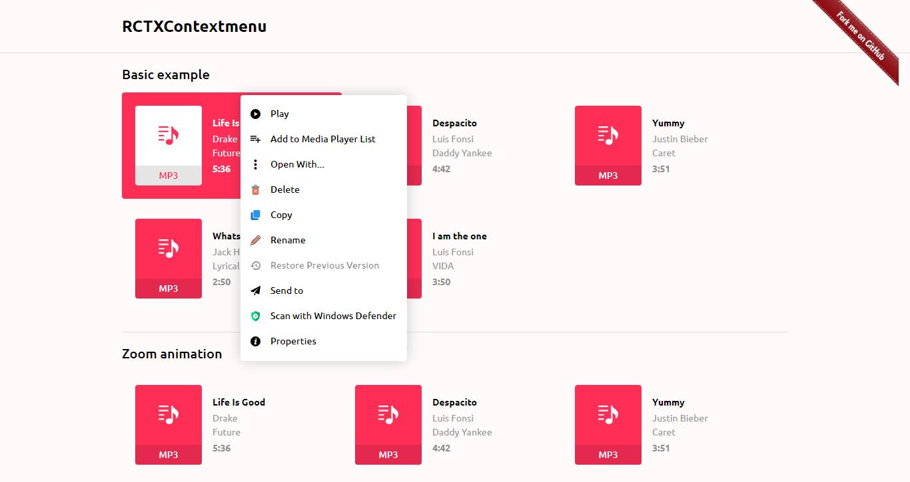

### Note: `rctx-contextmenu` Supports React 16.8 and above versions because this plugin solely uses React Hooks.

# rctx-contextmenu
Context menu plugin for React.
[Live Demo](https://reachtokish.github.io/rctx-contextmenu/) | [Example Code](https://github.com/reachtokish/rctx-contextmenu/tree/master/example)

[](https://reachtokish.github.io/rctx-contextmenu/)

## The problem :hushed:
There are lot of times when you want to customize the right click menu or Context Menu. May be you want to add more customized options or even sub options with same look and feel how a native context menu gives.

<!-- --------------------------------------------------- -->

## The solution :smile:
`rctx-contextmenu` gives that flexibility to customize Context Menu. You can add options, sub-options with exactly the look and feel how you get when you use the native Context Menu.

<!-- --------------------------------------------------- -->

## Key features
- Append to anywhere you want
- Customize styling like however you want
- In-built animation
- Extensive list of APIs

<!-- --------------------------------------------------- -->

## Browser Support
- IE 11 and Edge >= 12
- FireFox >= 38
- Chrome >= 47

<!-- --------------------------------------------------- -->

## Table of contents
- [Installation](#installation)
- [Sample Usage](#sample-usage)
- [Full Example Usage](#Full-example-usage)
- [Live Demo](#live-demo)
- [Example Code](#example-code)
- [APIs](#apis)
- [Styling](#styling)
- [Contributions](#contributions-pray)
- [LICENSE](#license)

<!-- --------------------------------------------------- -->

## Installation
```
npm install --save rctx-contextmenu
```

<!-- --------------------------------------------------- -->

## Sample Usage
```jsx
import React from 'react';
import { ContextMenuTrigger, ContextMenu, ContextMenuItem } from 'rctx-contextmenu';

function App() {
  return (
    <div className="app">
      <ContextMenuTrigger
        id="my-context-menu-1"
      >
        <div className="box">
          Right Click On Me
        </div>
      </ContextMenuTrigger>

      <ContextMenu id="my-context-menu-1">
        <ContextMenuItem>Menu Item 1</ContextMenuItem>
        <ContextMenuItem>Menu Item 2</ContextMenuItem>
        <ContextMenuItem>Menu Item 3</ContextMenuItem>
        <ContextMenuItem>Menu Item 4</ContextMenuItem>
      </ContextMenu>
    </div>
  );
}

export default App;
```
<!-- --------------------------------------------------- -->

## Full example usage
```jsx
<ContextMenu
  id="my-contextmenu"
  appendTo="body"
  animation="zoom"
  hideOnLeave={false}
  preventHideOnScroll={true}
  preventHideOnResize={true}
  attributes={{
    'aria-label': 'Some text',
    'aria-labelledby': 'Some text'
  }}
  className="my-context-menu"
  onMouseLeave={() => console.log('Mouse left')}
  onShow={() => console.log('I am visible!')}
  onHide={() => console.log('I am hidden!')}
/>
```

```jsx
<ContextMenuItem
  disabled={true}
  preventClose={false}
  attributes={{
    'aria-label': 'Some text',
    'aria-labelledby': 'Some text'
  }}
  className="my-context-menu-item"
  onClick={() => console.log("I'm clicked!")}
/>
```

```jsx
<ContextMenuTrigger
  id="my-contextmenu"
  disable={false}
  disableWhileShiftPressed={true}
  attributes={{
    'aria-label': 'Some text',
    'aria-labelledby': 'Some text'
  }}
  className="my-context-menu-trigger"
/>
```

```jsx
<Submenu
  title="My submenu"
  attributes={{
    'aria-label': 'Some text',
    'aria-labelledby': 'Some text'
  }}
  className="my-context-menu-submenu"
/>
```

## Live Demo
Live demo is available [here](https://reachtokish.github.io/rctx-contextmenu/).

<!-- --------------------------------------------------- -->

## Example Code
Example code is available [here](https://github.com/reachtokish/rctx-contextmenu/tree/master/example).

<!-- --------------------------------------------------- -->

## APIs
#### `<ContextMenu />`
<table class="table table-bordered table-striped">
  <thead>
  <tr>
    <th width="10%">Name</th>
    <th width="5%">Type</th>
    <th width="30%">Options</th>
    <th width="55%">Description</th>
  </tr>
  </thead>
  <tbody>
    <tr>
      <td>id</td>
      <td>String</td>
      <td>Should be a string.</td>
      <td>`ContextMenu` and `ContextMenuTrigger` id should match.</td>
    </tr>
    <tr>
      <td>appendTo</td>
      <td>String</td>
      <td>Should be a string which contains element selector like <strong>body</strong> / <strong>#id</strong> / <strong>.class</strong> . <strong>Default: Enclosed element</strong></td>
      <td>Append context menu inside required element.</td>
    </tr>
    <tr>
      <td>animation</td>
      <td>String</td>
      <td>Enums: <strong>fade</strong> | <strong>zoom<strong> | <strong>pop</strong> | <strong>toTopLeft</strong> | <strong>rightToLeft</strong></td>
      <td>Make the contextmenu visible in animated way.</td>
    </tr>
    <tr>
      <td>hideOnLeave</td>
      <td>Boolean</td>
      <td>true / false. <strong>Default: false</strong></td>
      <td>Hide contextmenu on blur or mouseOut.</td>
    </tr>
    <tr>
      <td>attributes</td>
      <td>Object</td>
      <td>-</td>
      <td>Add additional attributes to the element.</td>
    </tr>
    <tr>
      <td>className</td>
      <td>String</td>
      <td>-</td>
      <td>Additional classes.</td>
    </tr>
    <tr>
      <td>preventHideOnResize</td>
      <td>Boolean</td>
      <td>true / false. <strong>Default: false</strong></td>
      <td>Prevent hiding contextmenu from hiding on window resize.</td>
    </tr>
    <tr>
      <td>preventHideOnScroll</td>
      <td>Boolean</td>
      <td>true / false. <strong>Default: false</strong></td>
      <td>Prevent hiding contextmenu from hiding on scroll.</td>
    </tr>
    <tr>
      <td>onShow</td>
      <td>Function</td>
      <td>() => {}</td>
      <td>Trigger this event when Context Menu is visible.</td>
    </tr>
    <tr>
      <td>onHide</td>
      <td>Function</td>
      <td>() => {}</td>
      <td>Trigger this event when Context Menu is hidden.</td>
    </tr>
    <tr>
      <td>onMouseLeave</td>
      <td>Function</td>
      <td>() => {}</td>
      <td>Invoke onMouseLeave on blur or mouseOut.</td>
    </tr>
  </tbody>
</table>

#### `<ContextMenuItem />`
<table class="table table-bordered table-striped">
  <thead>
    <tr>
      <th width="10%">Name</th>
      <th width="5%">Type</th>
      <th width="30%">Options</th>
      <th width="55%">Description</th>
    </tr>
  </thead>
  <tbody>
    <tr>
      <td>disabled</td>
      <td>Boolean</td>
      <td>true / False . Default False</td>
      <td>Disable menu item.</td>
    </tr>
    <tr>
      <td>preventClose</td>
      <td>Boolean</td>
      <td>true / False . Default False</td>
      <td>Context menu is closed as soon as an item is clicked.</td>
    </tr>
    <tr>
      <td>disableWhileShiftPressed</td>
      <td>Boolean</td>
      <td>true / false. <strong>Default: false</strong></td>
      <td>Open browser default contextmenu if shift pressed while right click on trigger element.</td>
    </tr>
    <tr>
      <td>attributes</td>
      <td>Object</td>
      <td>-</td>
      <td>Add additional attributes to the element.</td>
    </tr>
    <tr>
      <td>className</td>
      <td>String</td>
      <td>-</td>
      <td>Additional classes.</td>
    </tr>
    <tr>
      <td>onClick</td>
      <td>Function</td>
      <td>() => {}</td>
      <td>Fire onClick event.</td>
    </tr>
  </tbody>
</table>

#### `<ContextMenuTrigger />`
<table class="table table-bordered table-striped">
  <thead>
    <tr>
      <th width="10%">Name</th>
      <th width="5%">Type</th>
      <th width="30%">Options</th>
      <th width="55%">Description</th>
    </tr>
  </thead>
  <tbody>
    <tr>
      <td>id</td>
      <td>String</td>
      <td>Should be a string.</td>
      <td>`ContextMenu` and `ContextMenuTrigger` id should match.</td>
    </tr>
    <tr>
      <td>attributes</td>
      <td>Object</td>
      <td>-</td>
      <td>Add additional attributes to the element.</td>
    </tr>
    <tr>
      <td>disable</td>
      <td>true / false. <strong>Default: false</strong></td>
      <td>false</td>
      <td>Disable contextmenu and open browser default contextmenu.</td>
    </tr>
    <tr>
      <td>className</td>
      <td>String</td>
      <td>-</td>
      <td>Additional classes.</td>
    </tr>
  </tbody>
</table>

#### `<Submenu />`
<table class="table table-bordered table-striped">
  <thead>
    <tr>
      <th width="10%">Name</th>
      <th width="5%">Type</th>
      <th width="30%">Options</th>
      <th width="55%">Description</th>
    </tr>
  </thead>
  <tbody>
    <tr>
      <td>title</td>
      <td>String</td>
      <td>Should be a string.</td>
      <td>Title for the Submenu.</td>
    </tr>
    <tr>
      <td>attributes</td>
      <td>Object</td>
      <td>-</td>
      <td>Add additional attributes to the element.</td>
    </tr>
    <tr>
      <td>className</td>
      <td>String</td>
      <td>-</td>
      <td>Additional classes.</td>
    </tr>
  </tbody>
</table>

<!-- --------------------------------------------------- -->

## Styling
Styling is totally up to you. You can use CSS or even SCSS to customize the styling part. Below are the classes you can consider for styling

- **menu-trigger** (Right click area wrapper)
- **contextmenu** (The Context Menu)
- **contextmenu__item** (Each Context Menu item)
- **contextmenu__item--disabled** (Context Menu item)
- **submenu** (Context Submenu)
- **submenu__item** (Context Submenu item)

<!-- --------------------------------------------------- -->

## Contributions :pray:
Any kind of contribution would be much appreciated. It could be small change in the doc or even any kind of advice. You can create issues if you feel any feature which is missing which solves bigger problems.

<!-- --------------------------------------------------- -->

## Develop locally
First clone the repo
```
https://github.com/reachtokish/rctx-contextmenu.git
```
Navigate inside rctx-contextmenu folder
```
cd rctx-contextmenu
```
Then start server to run it locally
```
npm start
```
Now app should run on `localhost:1234`

<!-- --------------------------------------------------- -->

## License
MIT License